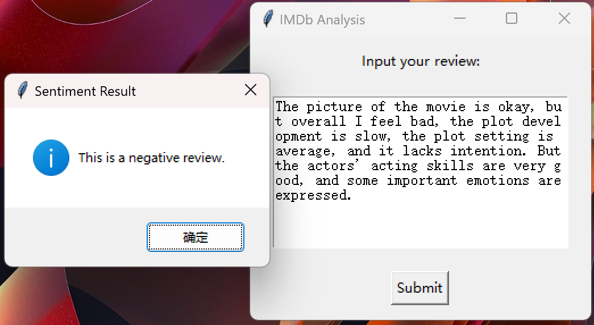

# IMDb Movie Review Sentiment Analysis System

English / [中文](readme_zh.md)

↑ 点击切换语言

This project is based on LSTM (Long Short-Term Memory) neural networks. By training on 40,000 movie reviews from the IMDb website, it builds a system capable of automatically analyzing the sentiment of English movie reviews.



## Table of Contents

- [Introduction](#introduction)
- [Multilingual Comments](#multilingual-comments)
- [Dataset](#dataset)
- [File Structure](#file-structure)
- [Notice](#notice)
- [Contribution](#contribution)


## Introduction

The main goals of this project are:
1. To construct and train an efficient LSTM model from data processing, enabling it to analyze the sentiment of a given movie review.
2. To develop a simple GUI based on tkinter, as shown above, which can intuitively display the input reviews and provide sentiment analysis results.

Each piece of code is accompanied by comments to make the logic and flow easy to understand, though it doesn't go into detailed explanations of the underlying principles. Therefore, if you're unfamiliar with LSTM, you might want to brush up on it a bit.

## Multilingual Comments

To make it easier for developers from different language backgrounds to understand the code, comments in this project are provided in both English and Chinese.

## Dataset

The dataset used in this project is sourced from [Kaggle](https://www.kaggle.com/datasets/lakshmi25npathi/imdb-dataset-of-50k-movie-reviews).
Please download the dataset directly from the provided link and place it in the data folder.


## File Structure

The project's file structure is as follows:

```c++
IMDb analysis/
│
├── data/ 
│   └── IMDB Dataset.csv
│
├── model/
│   ├── sentiment_model.pt
│   └── training.log 
│
├── preprocessed_data/
│   ├── x.pkl
│   ├── y.pkl
│   ├── index_to_word.pkl
│   ├── word_to_index.pkl
│   ├── word_count.pkl
│   ├── corpus_idx.pkl
│   ├── X_test.pkl
│   ├── X_train.pkl
│   ├── y_test.pkl
│   ├── y_train.pkl
│   └── y_converted.pkl 
│
├── utils(en/zh)/
│   ├── __init__.py 
│   ├── data_loader.ipynb
│   ├── data_loader.py
│   ├── vocab_builder.ipynb
│   ├── vocab_builder.py
│   ├── data_process.py
│   ├── model.py
│   ├── train.py
│   ├── predict.py
│   ├── predict_review.py
│   └── GUI.py
└── main.py 
```
## Notice

Due to GitHub's file size limit of 25MB, I am unable to upload the dataset and model files directly to this repository. As a result, only the code is available here and I apologize for it.

## Contribution

All forms of contributions are welcome! Whether it's reporting bugs or suggesting new features, Thank you so much!!!
