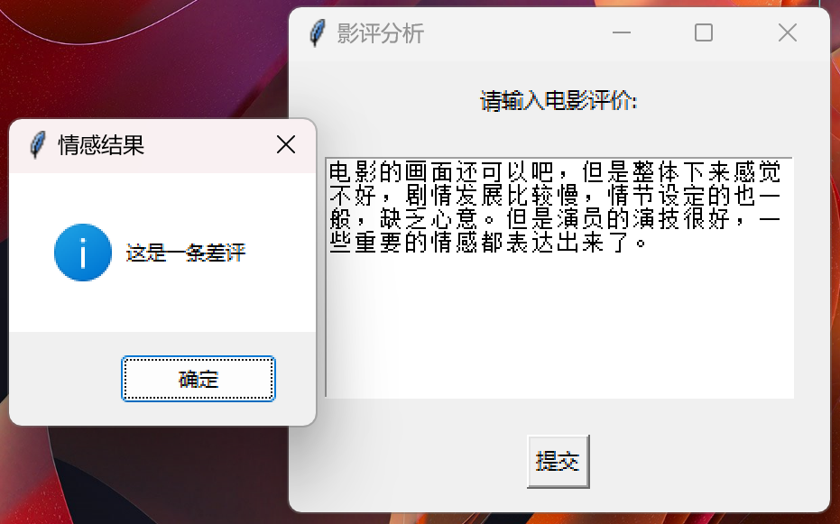

# IMDb 电影评论情感分析系统

[English](readme.md)  /  中文

↑ Click to switch language

本项目基于LSTM (Long Short-Term Memory) 也就是常说的长短期记忆神经网络 通过对4万条在IMDb网站上的电影评论进行训练 使其构建成一个能够自动分析中文影评情感的系统



## 目录

- [介绍](#介绍)
- [多语言注释](#多语言注释)
- [数据集](#数据集)
- [文件结构](#文件结构)
- [注意事项](#注意事项)
- [贡献](#贡献)

## 介绍

本项目的主要目标：

1. 从数据处理开始 构建并训练一个高效的LSTM模型 使其能够分析该条电影评论的情感倾向

2. 开发一个基于tkinter的简单GUI界面 如上图所示 可直观的显示输入的评论并获得情感分析的结果
   每段代码都附有注释 便于简单的理解代码的逻辑和流程 但并未对底层逻辑进行详细解释 所以如果不知道LSTM相关知识的话 可以先去简单补习一下

## 多语言注释

为了让不同语言背景的开发者更容易理解代码 本项目的注释提供了英文和中文两种版本

## 数据集

本项目使用的数据集来源于[Kaggle](https://www.kaggle.com/datasets/lakshmi25npathi/imdb-dataset-of-50k-movie-reviews)
请直接从提供的链接下载数据集 并将其放置在data文件夹中

## 文件结构

项目的文件结构如下

```c++
IMDb analysis/
│
├── data/ 
│   └── IMDB Dataset.csv
│
├── model/
│   ├── sentiment_model.pt
│   └── training.log 
│
├── preprocessed_data/
│   ├── x.pkl
│   ├── y.pkl
│   ├── index_to_word.pkl
│   ├── word_to_index.pkl
│   ├── word_count.pkl
│   ├── corpus_idx.pkl
│   ├── X_test.pkl
│   ├── X_train.pkl
│   ├── y_test.pkl
│   ├── y_train.pkl
│   └── y_converted.pkl 
│
├── utils(en/zh)/
│   ├── __init__.py 
│   ├── data_loader.ipynb
│   ├── data_loader.py
│   ├── vocab_builder.ipynb
│   ├── vocab_builder.py
│   ├── data_process.py
│   ├── model.py
│   ├── train.py
│   ├── predict.py
│   ├── predict_review.py
│   └── GUI.py
└── main.py 
```

## 注意事项

因为GitHub的文件上传最大为25MB 所以我无法将处理后的数据集和模型上传到该项目 所以这里仅提供代码和思路 抱歉

## 贡献

欢迎所有形式的贡献！无论是报告错误还是提出建议 非常感谢！！